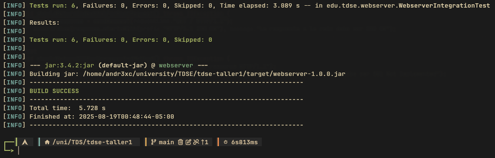

<div align="center">
<h1 align="center">Framework-IOC</h1>
<p align="center">
A minimalist, custom-built framework for rapid and observable web service development.
</p>
</div>

</br>

## About

This project is a custom, lightweight full-stack framework designed for building modern, high-performance web applications. It leverages a modular architecture to provide a cohesive environment for both RESTful API development and static asset serving, with a strong emphasis on **diagnostics and observability**.

---

## Key Features

-   **Annotation-Based Routing (Spring-Style)**: Define REST endpoints with intuitive annotations directly on your controller classes, heavily inspired by **Spring Boot**. Use decorators like `@Controller` to designate routing classes and `@GetMapping`, `@PostMapping`, etc., to bind HTTP methods directly to your business logic handlers. This provides a clean, declarative, and familiar development experience.
-   **Integrated Static File Server**: Efficiently serve static assets such as HTML, CSS, JavaScript, and images with configurable root directories.
-   **Request & Response Middleware**: A pipeline-based system for intercepting requests and responses, enabling functionalities like authentication, logging, and data validation.
-   **Dependency Injection**: Manages service dependencies, promoting a decoupled and testable codebase.
-   **Integrated Observability with Custom Tagging**: Automatically instruments key operations and allows developers to add **custom tags** to metrics, logs, and traces. This enables granular filtering and analysis of application performance based on business-specific contexts (e.g., `tenant_id`, `user_tier`).
-   **Component & Request Tracing**: Incorporates built-in **element trackers** that provide end-to-end visibility into the request lifecycle. It allows tracing a request's path through different services and components, identifying performance bottlenecks and error sources with precision.

Built with a focus on simplicity and performance, this framework aims to streamline the development of robust, maintainable, and scalable web services. It's an ideal foundation for rapid prototyping and production-ready microservices.

### Core Components

-   **HttpServer**: The application's entry point. It initializes the server, listens for incoming connections, and passes them off to the `HttpRequestHandler` for processing.
-   **HttpRequestHandler**: The main dispatcher or "Front Controller." It inspects each request to differentiate between static file requests and dynamic API endpoints, routing the latter to the Framework Core.
-   **Framework Core**: The framework's routing engine. On startup, it scans all `@RestController` classes to build a route map, and at runtime, it invokes the correct controller method for an incoming request.
-   **Annotations**: The declarative API for developers. Provides a set of Spring Boot-inspired annotations (`@RestController`, `@GetMapping`, etc.) for defining routes and binding request parameters without boilerplate code.
-   **Controllers**: The application-specific business logic layer. These are the user-defined classes that implement the API endpoints, such as `GreetingController` and `PañetteController`.

</br>
</br>

## Installation & usage

### Prerequisites

To run this server correctly, you need the following applications installed:
- Java
- Bash
- Git

</br>

### Installation

- Clone the repository and navigate into the project directory where the pom.xml is located:

```sh
git clone https://github.com/Andr3xDev/ioc-framework
cd ioc-framework
```

- Build the project & run it:

```sh
mvn clean verify
java -jar target/framework-1.0.0.jar
```


The console should display the message of connection:
```
INFO: Server started on port: 35000
```

</br>
</br>

## Architecture

The core of this architecture is built around a central Request Handler. This component is solely responsible for processing incoming Request objects, routing them to the appropriate business logic, and ultimately generating and sending the final Response back to the client.


</br>
</br>

## Test Report

### Acceptance Tests

Manual acceptance tests were performed by requesting different resources to confirm they are served correctly, including:

- index.html


- styles.css


- API test 1


- API test 2


- API test 3


- image1.png


- Not existing resources


</br>

### Unit Tests

There are a suite of integration tests validates server reliability by booting a live instance and sending real HTTP requests. These tests confirm that both static and API endpoints return the expected status codes, headers, and content, ensuring correct end-to-end behavior.


